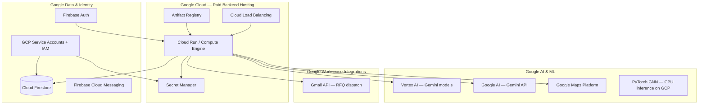
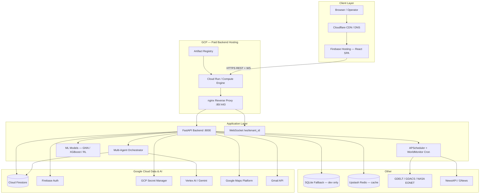
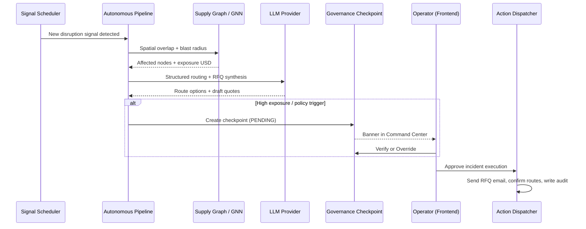

# Praecantator

**Autonomous AI-Driven Supply Chain Risk Management (SCRM)**

Praecantator is an enterprise-grade platform that continuously monitors global supply chain networks, predicts cascading disruption risks using graph-based intelligence and machine learning, and autonomously orchestrates mitigation strategies — optimal rerouting, backup supplier engagement, RFQ generation, and audit-grade decision trails — through a multi-agent system with human-in-the-loop governance.

The platform transitions operations from static, backward-looking dashboards to proactive, forward-looking AI workflows. Operators interact through a tactical command center while autonomous pipelines handle detection, assessment, and disruption response in seconds, automatically evaluating every feasible sea, land, and air logistics path to recommend the fastest, cheapest, or lowest-risk option.

---

## Table of Contents

1. [Problem Statement](#problem-statement)
2. [Solution Overview](#solution-overview)
3. [Google Cloud Stack](#google-cloud-stack)
4. [System Architecture](#system-architecture)
5. [Autonomous OODA Pipeline](#autonomous-ooda-pipeline)
6. [Multi-Agent System](#multi-agent-system)
7. [Machine Learning & Graph Intelligence](#machine-learning--graph-intelligence)
8. [Global Intelligence Layer](#global-intelligence-layer)
9. [Enterprise Governance & Security](#enterprise-governance--security)
10. [Frontend Application](#frontend-application)
11. [Backend API Engine](#backend-api-engine)
12. [Project Structure](#project-structure)
13. [Environment Configuration](#environment-configuration)
14. [Local Development](#local-development)
15. [Production Deployment](#production-deployment)
16. [Testing](#testing)
17. [Sample Data](#sample-data)
18. [Architecture Evolution Phases](#architecture-evolution-phases)

---

## Problem Statement

Modern supply chains span thousands of tier-1, tier-2, and tier-3 suppliers across continents. Disruptions — typhoons closing ports, geopolitical conflicts, tariff changes, labor strikes, wildfires, and shipping chokepoint congestion — propagate nonlinearly through supplier graphs. Traditional SCRM tools:

- React after damage is done, using static spreadsheets and manual escalation
- Treat suppliers as rows in a table rather than nodes in an interconnected network
- Lack spatial awareness of how external events overlap with supplier geographies
- Produce alerts without actionable routing alternatives or procurement drafts
- Offer no audit trail proving *why* a decision was made

Praecantator addresses these gaps with continuous signal ingestion, graph-based blast-radius calculation, multi-modal route simulation, LLM-assisted RFQ drafting, and immutable reasoning logs — all gated by role-based access control and governance checkpoints for high-exposure actions.

---

## Solution Overview

| Capability | Description |
|---|---|
| **Continuous Monitoring** | Background cron fetchers ingest earthquakes, disasters, conflicts, news, market data, chokepoint status, shipping stress, and more |
| **Graph Risk Propagation** | `CustomerSupplyGraph` models suppliers, logistics hubs, and edges; GNN-style propagation estimates downstream exposure |
| **Autonomous Response** | Pipeline runs DETECT → ASSESS → DECIDE → ACT → AUDIT in under 3 seconds for qualifying events |
| **Human Governance** | High-value or high-risk actions pause at checkpoints until an authorized operator approves |
| **Multi-Modal Routing** | Automatically evaluates every feasible sea, land, and air logistics path and recommends the fastest, cheapest, or lowest-risk option during disruption |
| **Procurement Automation** | RFQ drafts generated per affected supplier; email dispatch with action confirmation ledger |
| **Audit & Compliance** | Every reasoning step, checkpoint, feedback verdict, and action status is persisted and exportable as PDF |
| **Multi-Tenancy** | Strict tenant isolation — no cross-customer data bleed; DUNS/LEI entity resolution for shared supplier overlays |

---

## Google Cloud Stack

Praecantator is built on the **Google Cloud ecosystem** for the [Google Solution Challenge 2026](https://developers.google.com/community/gdsc-solution-challenge). The backend is designed to run on **paid GCP infrastructure** while the frontend is hosted on **Firebase Hosting** with **Cloudflare** in front for DNS, CDN, and edge protection.

### Stack at a Glance



### Google Cloud Platform (GCP) — Backend Hosting (Paid)

The backend FastAPI service is containerized (`Backend/Dockerfile`) and intended for deployment on **GCP compute**, 

| GCP Service | Role | Billing |
|---|---|---|
| **Compute Engine** |  VM + `docker compose` + nginx (same as `deploy.sh`, but on a GCE instance) | Pay per VM instance hours + disk |
| **Artifact Registry** | Store and version backend Docker images for Cloud Run / GKE pulls | Pay per storage + egress |
| **Cloud Load Balancing** | HTTPS termination, WebSocket pass-through (`/ws/{tenant_id}`), global anycast | Pay per rule + traffic |
| **Cloud Armor** | Optional WAF / DDoS protection in front of the API | Pay per policy + requests |
| **VPC + Serverless VPC Access** | Private connectivity between Cloud Run and Firestore / internal services | Pay per connector |
| **Cloud Logging & Monitoring** | Centralized logs from uvicorn, APScheduler, WorldMonitor cron, agent pipelines | Free tier + pay per volume |


**Why  GCP for the backend?** The stack loads PyTorch, runs background schedulers (APScheduler + WorldMonitor cron), maintains WebSocket connections, and executes multi-agent LLM workflows — workloads that need always-on or burstable compute with Firestore and Secret Manager in the same GCP project.

### Google AI — Gemini & Vertex AI

| Service | Use in Praecantator |
|---|---|
| **Google AI — Gemini API** | LLM via `LLM_PROVIDER=gemini` and `google-generativeai` (`services/llm_provider.py`). Model: **Gemini 2.0 Flash** for routing synthesis, RFQ drafts, workflow reports, market implications |
| **Vertex AI** | Enterprise Gemini with IAM-native auth, VPC-SC, model versioning, batch prediction, and **Vertex AI endpoints** for GNN/XGBoost model serving at scale |
| **Vertex AI Gemini** | Gemini models billed through your GCP project via Vertex `aiplatform.googleapis.com` endpoints |
| **Vertex AI Training / Pipelines** | Offline retraining for XGBoost (`ml/train_xgboost.py`) and RL (`ml/train_rl.py`) |

### Firebase (Google)

| Service | Role |
|---|---|
| **Firebase Authentication** | Google Sign-In on the frontend (`firebase/auth`); ID tokens verified by Firebase Admin SDK on the backend |
| **Firebase Admin SDK** | `AUTH_PROVIDER=firebase` — production token verification (`services/firebase_auth.py`) |
| **Cloud Firestore** | Primary multi-tenant database — incidents, signals, contexts, audit, RFQ, orchestration runs, WorldMonitor cache |
| **Firebase Cloud Messaging (FCM)** | Push notifications to operators (`services/fcm.py`) when `FIREBASE_ADMIN_ENABLED=true` |

Frontend Firebase Web SDK: `Frontend/src/lib/firebase.ts`. Build step syncs Firebase auth assets: `scripts/sync-firebase-auth-assets.mjs`.

### Google Maps Platform

| API | Role |
|---|---|
| **Routes API** | Live land routing (`routes.googleapis.com`) when `GOOGLE_MAPS_USE_LIVE=true` |
| **Maps JavaScript API** | 3D incident flyover in AR View |
| **Geocoding** | Supplier and signal location resolution (via backend `services/signal_geocode.py`) |

API key is served from `/api/config/maps` — never baked into the frontend build.

### Google Workspace & APIs

| API | Role |
|---|---|
| **Gmail API** | RFQ email dispatch via OAuth2 (`services/mailer.py`, `google-api-python-client`) |
| **GCP Secret Manager** | Production secrets — API keys, Gmail tokens, Redis URLs (`services/secret_manager.py`, `GCP_PROJECT_ID`) |
| **Google Auth / IAM** | Service account key (`GOOGLE_APPLICATION_CREDENTIALS`) for Firestore, Secret Manager, FCM, Vertex |

### Python Google SDKs (Backend `requirements.txt`)

| Package | GCP / Google Service |
|---|---|
| `google-cloud-firestore` | Cloud Firestore |
| `google-cloud-secret-manager` | Secret Manager |
| `firebase-admin` | Firebase Auth, FCM, Firestore Admin |
| `google-generativeai` | Gemini (Google AI API) |
| `google-api-python-client` | Gmail API, Maps |
| `google-auth` | OAuth2 + service account credentials |

### Environment Variables (Google-specific)

| Variable | Service |
|---|---|
| `GCP_PROJECT_ID` / `GCLOUD_PROJECT` / `GOOGLE_CLOUD_PROJECT` | GCP project identity |
| `FIREBASE_PROJECT_ID` | Firebase / Firestore project |
| `GOOGLE_APPLICATION_CREDENTIALS` | Service account JSON path |
| `GOOGLE_API_KEY` / `GEMINI_API_KEY` | Gemini (Google AI) |
| `GOOGLE_MAPS_API_KEY` | Maps Platform |
| `GMAIL_CLIENT_ID` / `GMAIL_CLIENT_SECRET` | Gmail API OAuth |
| `AUTH_PROVIDER=firebase` | Firebase Auth mode |
| `DB_PROVIDER=firestore` | Firestore persistence |
| `LLM_PROVIDER=gemini` | Gemini LLM |

---

## System Architecture

Praecantator uses a decoupled architecture: a React/Vite frontend on **Firebase Hosting** behind **Cloudflare**, and a Python FastAPI backend on **paid Google Cloud** (Cloud Run or Compute Engine) or Docker + nginx on any host, with **Firestore**, **Firebase Auth**, **Gemini / Vertex AI**, and **Google Maps** as core Google services.



### Request Flow (Incident Response)



---

## Autonomous OODA Pipeline

The core cognitive loop is implemented in `Backend/agents/autonomous_pipeline.py` and follows the military OODA model adapted for supply chains:

| Stage | Agent / Module | What Happens |
|---|---|---|
| **DETECT** | `signal_agent`, `political_risk_agent` | Match live signals (NASA EONET, GDACS, GDELT, news) against customer supplier coordinates using haversine distance and dynamic impact radii |
| **ASSESS** | `assessment_agent`, GNN stub | Propagate risk through `CustomerSupplyGraph`; compute VaR, BOM criticality, tier weights, lane disruption multipliers |
| **DECIDE** | `routing_agent`, `logistics_risk_agent`, `tariff_risk_agent` | Evaluate feasible sea, land, and air routes; recommend the fastest, cheapest, or lowest-risk option for the disruption context |
| **ACT** | `rfq_agent`, `action_confirmation` | Draft and optionally send RFQs; dispatch route confirmations; track DRAFT → SENT → DELIVERED → ACKNOWLEDGED |
| **AUDIT** | `reasoning_logger`, `pdf/certificate` | Append immutable reasoning steps; generate compliance certificates and workflow audit PDFs |

### Pipeline Timing

Steps 1–7 run fully autonomously with no human input (target: under 3 seconds). Step 8 presents a pre-analyzed incident card to the operator. Step 9 executes approved actions.

### Governance Intercepts

Before ACT, `services/governance_checkpoint.py` evaluates triggers:

- Total exposure USD above tenant threshold
- Multi-million-dollar routing adjustments
- Low scenario confidence bounds
- Intelligence gap reports flagging stale signals or poor context quality

When triggered, the pipeline halts and creates a `PENDING` checkpoint. Operators verify via `/api/governance/checkpoints/verify` or override with a mandatory reason.

### Idempotency & Replay

`services/idempotency.py` prevents duplicate side effects if a pipeline fails mid-ACT (e.g., SMTP timeout). Failed runs can be replayed via:

- `POST /api/orchestration/replay/workflow/{workflow_id}`
- `POST /api/orchestration/replay/autonomous/{run_id}`

---

## Multi-Agent System

Praecantator operates three orchestration paths defined in `Backend/agents/governance.py`:

| Path | Entry Point | Agents Allowed |
|---|---|---|
| `chat_manager` | `POST /api/agents/chat` | signal, assessment, routing, supervisor, scheduler, political, tariff, logistics, reporting, assistant |
| `workflow_graph` | `POST /api/workflow/start` | signal, assessment, routing, rfq, audit, scheduler, political, tariff, logistics |
| `autonomous_pipeline` | Background + incident engine | signal, graph, assessment, routing, logistics, political, tariff, decision, rfq, notification, action, audit |

### Core Workflow Agents

| Agent | File | Responsibility |
|---|---|---|
| **Signal Agent** | `agents/signal_agent.py` | Fetches and normalizes GDELT, NASA EONET, NewsAPI, GNews signals |
| **Assessment Agent** | `agents/assessment_agent.py` | Quantifies structural disruption impact on affected suppliers |
| **Routing Agent** | `agents/routing_agent.py` | Multi-modal route evaluation using `routing/sea.py`, `routing/land.py`, `routing/air.py` |
| **RFQ Agent** | `agents/rfq_agent.py` | LLM-generated procurement drafts customized per supplier |
| **Reasoning Logger** | `agents/reasoning_logger.py` | Chronological audit of every agent decision |
| **Risk Calculator** | `agents/risk_calculator.py` | Aggregates exposure scores across the network |
| **Citation Tracker** | `agents/citation_tracker.py` | Links decisions to source signals |

### Specialized Analysis Agents

| Agent | File | Responsibility |
|---|---|---|
| **Scheduler Agent** | `agents/scheduler_agent.py` | Builds schedule context for downstream risk agents |
| **Political Risk Agent** | `agents/political_risk_agent.py` | Geopolitical event analysis and risk polygons |
| **Tariff Risk Agent** | `agents/tariff_risk_agent.py` | Trade policy and tariff exposure |
| **Logistics Risk Agent** | `agents/logistics_risk_agent.py` | Port congestion, lane disruption, mode recommendations |
| **Reporting Agent** | `agents/reporting_agent.py` | Consolidated executive report from all agent outputs |
| **Assistant Agent** | `agents/assistant_agent.py` | Conversational copilot for operators |
| **Supervisor Agent** | `agents/supervisor_agent.py` | Packets and coordinates multi-agent chat sessions |

### LangGraph Workflow

`Backend/workflows/langgraph_workflow.py` implements a stateful graph with:

- Conditional routing after assessment (skip routing if zero affected suppliers)
- Mandatory human gate before RFQ send (`route_after_routing → human_gate`)
- In-memory checkpoint saver for workflow resume
- RL mode recommendation via `ml/rl_agent.py`

### MCP Server

`Backend/mcp_server.py` exposes Praecantator capabilities as MCP tools for external agent integrations (supplier exposure lookup, workflow triggers, signal fetching).

---

## Machine Learning & Graph Intelligence

### Customer Supply Graph

`Backend/models/supply_graph.py` is the single source of truth for all graph operations.

**Node types:** `supplier` | `logistics` | `customer`

**Key fields per node:**
- Geo: `lat`, `lng`, `country`, `city`, `region`
- Business: `tier`, `duns_number`, `lei`, `contract_value_usd`, `contract_currency`, `incoterm`
- Risk: `exposure_score`, `bom_criticality`, `daily_throughput_usd`, `is_pre_qualified`
- Tenancy: `tenant_id` (row-level isolation)

**Construction methods:**
- `CustomerSupplyGraph.from_context(user_context)` — from onboarding data
- `CustomerSupplyGraph.from_dataset(csv_path)` — from canonical datasets

### GNN Risk Propagation

`Backend/ml/gnn_stub.py` and `Backend/ml/gnn_model.py` implement graph neural network-style disruption propagation. When a `DisruptionEvent` occurs, risk radiates through supply edges with spatial quadrant optimizations to prevent OOM during live disaster evaluation.

### XGBoost Exposure Model

`Backend/ml/xgboost_model.py` trains on historical disruption data (`Backend/Dataset/Global_Supply_Chain_Disruption.csv`). Endpoint: `POST /ml/train/xgboost`.

### Reinforcement Learning Router

`Backend/ml/rl_agent.py` (Stable-Baselines3) recommends optimal transport mode given state vectors. Trained via `Backend/ml/train_rl.py`.

### Monte Carlo Simulation

`Backend/services/monte_carlo.py` and `Backend/agents/monte_carlo_pipeline.py` run probabilistic scenario analysis. Endpoints:

- `POST /api/intelligence/monte-carlo`
- `GET /api/intelligence/monte-carlo/incidents`

### Bill-of-Materials Awareness

The pipeline understands product characteristics at BOM granularity. Perishable logistics calculate total loss vectors and can override naive AI routing suggestions. ERP live hydration (`services/erp_sync.py`) fetches dynamic throughput rates before graph traversal.

---

## Global Intelligence Layer

`Backend/services/worldmonitor_fetcher.py` runs as a background cron service (APScheduler), fetching and caching global intelligence into Firestore. The frontend polls `/api/global/*` endpoints — no frontend API keys required.

### Data Source Tiers

**Tier 0 — No API key required (always active):**

| Source | Data |
|---|---|
| NASA EONET | Wildfires, storms, floods |
| USGS | Earthquakes |
| GDACS | Global disaster alerts |
| GDELT | Geopolitical events |
| OpenMeteo | Weather data |
| IMF PortWatch | Chokepoint transit data |
| GIE AGSI | EU gas storage |

**Tier 1 — Free API key (configure in `Backend/.env`):**

| Source | Env Variable |
|---|---|
| ACLED | `ACLED_EMAIL` + `ACLED_PASSWORD` or `ACLED_ACCESS_TOKEN` |
| NewsAPI | `NEWSAPI_API_KEY` |
| GNews | `GNEWS_API_KEY` |
| NASA FIRMS | `NASA_FIRMS_MAP_KEY` |
| Finnhub | `FINNHUB_API_KEY` |
| EIA | `EIA_API_KEY` |
| FRED | `FRED_API_KEY` |
| OpenAQ | `OPENAQ_API_KEY` |
| AviationStack | `AVIATIONSTACK_API` |
| Groq | `GROQ_API_KEY` (market implications AI) |

**Tier 2 — Optional premium:** AISStream, Cloudflare Radar

### Global API Endpoints

| Endpoint | Content |
|---|---|
| `GET /api/global/hazards` | Natural hazard events |
| `GET /api/global/earthquakes` | USGS seismic data |
| `GET /api/global/conflict` | ACLED conflict events |
| `GET /api/global/gdelt` | GDELT geopolitical feed |
| `GET /api/global/disasters` | GDACS alerts |
| `GET /api/global/news/supply-chain` | Supply chain news |
| `GET /api/global/market/quotes` | Market quotes (Finnhub) |
| `GET /api/global/energy` | Energy prices (EIA) |
| `GET /api/global/macro` | Macro indicators (FRED) |
| `GET /api/global/chokepoints` | Suez, Malacca, Hormuz, Panama, Taiwan Strait, etc. |
| `GET /api/global/shipping/stress` | Shipping stress index |
| `GET /api/global/shipping/indices` | Baltic Dry, container indices |
| `GET /api/global/shipping/rates` | Freight rates |
| `GET /api/global/country-instability` | Country instability scores |
| `GET /api/global/strategic-risk` | Strategic risk overlay |
| `GET /api/global/market-implications` | AI-generated market implications |
| `GET /api/global/fires` | NASA FIRMS active fires |
| `GET /api/global/aviation` | Aviation intelligence |
| `GET /api/global/air-quality` | OpenAQ readings |
| `GET /api/global/minerals` | Critical minerals supply |
| `GET /api/global/summary` | Aggregated intelligence summary |
| `GET /api/global/dashboard-bundle` | Single-call bundle for Command Center |
| `POST /api/global/refresh` | Force refresh all fetchers |

Enable the fetcher cron: `WORLDMONITOR_FETCHER_ENABLED=true` in `Backend/.env`.

### Canonical Chokepoints Monitored

Suez Canal, Strait of Malacca, Strait of Hormuz, Bab el-Mandeb, Panama Canal, Taiwan Strait, Cape of Good Hope, Strait of Gibraltar — each with traffic percentage, category (trade/oil/semiconductors), and PortWatch integration.

---

## Enterprise Governance & Security

### Role-Based Access Control

`Backend/services/authorization.py` enforces stateless JWT-based RBAC:

| Role | Permissions |
|---|---|
| `superadmin` | All permissions, cross-tenant |
| `admin` | Approve/dismiss incidents, read/write graph, trigger workflows, read audit |
| `analyst` | Read + annotate incidents; cannot approve |
| `viewer` | Read-only: incidents, signals, graph |
| `service` | Internal pipeline writes |

**Permission examples:** `incident:read`, `incident:approve`, `graph:write`, `workflow:trigger`, `audit:read`

Audit records are immutable — no role can delete or modify audit logs.

### Authentication Providers

Switchable via `AUTH_PROVIDER` environment variable:

| Provider | Use Case |
|---|---|
| `local` | Email/password with Argon2 hashing + JWT (`services/security.py`) |
| `firebase` | Google Sign-In via Firebase Admin SDK (`services/firebase_auth.py`) |

Development bypass: `LOCAL_AUTH_BYPASS=true` (disabled in production).

### Multi-Tenant Isolation

Every Firestore document is scoped by `tenant_id`. The authorization layer rejects cross-tenant reads at the API edge. Integration test `Backend/tests/test_data_isolation.py` verifies Tenant A cannot read Tenant B incidents.

`services/tenant_quota.py` enforces per-tenant load limits.

### Intelligence Gap Tracker

`services/intelligence_gap_tracker.py` monitors data quality:

- Context quality score minimum
- Signal staleness ratio
- Low correlation ratio between signals and suppliers
- Pending master data changes
- Registry staleness

Endpoint: `GET /api/intelligence/gaps`

### Action Confirmation Ledger

`services/action_confirmation.py` tracks every external action:

```
DRAFT → SENT → DELIVERED → ACKNOWLEDGED
                    ↘ FAILED
```

### Post-Action Verification

Governance feedback (`true-positive`, `false-positive`, etc.) feeds threshold calibration via `services/threshold_tuner.py`.

Endpoints:
- `GET /api/governance/summary` — precision, recall, F1 metrics
- `GET /api/governance/post-action/{incident_id}` — full verification record
- `POST /api/governance/feedback` — operator verdict submission

---

## Frontend Application

Built with **React 18**, **TypeScript 5.6**, **Vite 8**, and **Tailwind CSS 4**. Deployed as a static SPA on **Firebase Hosting** with **Cloudflare** handling DNS, CDN, and edge protection.

### Dashboard Modules

| Route | Page | Purpose |
|---|---|---|
| `/` | Landing Page | Product introduction |
| `/login` | Login | Email/password or Google Sign-In (Firebase) |
| `/register` | Register | Account creation |
| `/onboarding` | Onboarding | CSV supplier upload, DUNS/LEI validation, geospatial staging |
| `/dashboard` | Command Center | KPIs, live incident map, confidence rings, governance banners |
| `/dashboard/network` | Network View | Supplier graph visualization, risk heatmaps, global intelligence overlay |
| `/dashboard/ar-view` | AR View | 3D globe (react-globe.gl) + Google Maps flyover for incidents |
| `/dashboard/incidents` | Incidents | Incident cards, approval/dismiss, reasoning timeline |
| `/dashboard/incident-simulator` | Incident Simulator | Monte Carlo and what-if scenario testing |
| `/dashboard/intelligence` | Intelligence | Global signal feeds, chokepoints, market data |
| `/dashboard/compliance` | Compliance | Audit logs, PDF export, governance metrics |
| `/dashboard/settings` | Settings | Profile, billing, data health |
| `/dashboard/route-viewer` | Route Viewer | Multi-modal corridor visualization (MapLibre + OSRM) |

### Key Frontend Components

| Component | Location | Role |
|---|---|---|
| `DecisionConsole` | `components/workflow/` | Operator decision interface for workflow stages |
| `CheckpointBanner` | `components/workflow/` | Governance checkpoint alert requiring sign-off |
| `ReasoningPanel` | `components/workflow/` | Chronological AI reasoning steps |
| `AgentCopilotPanel` | `components/workflow/` | Conversational multi-agent chat |
| `AgentSystemGrid` | `components/workflow/` | Live agent status grid |
| `GovernanceFeedbackWidget` | `components/workflow/` | Post-action verdict submission |
| `SupplyChainGlobe` | `components/ar/` | 3D globe supplier visualization |
| `IncidentFlyoverMap` | `components/ar/` | Google Maps 3D incident flyover |
| `DashboardLayout` | `components/` | Sidebar navigation shell |

### State Management

- **TanStack Query (React Query):** Server state caching, revalidation, optimistic updates
- **React Router DOM 6:** Client-side routing with lazy-loaded pages
- **Custom hooks:** `use-dashboard.ts`, `use-workflow-spine.ts`, `use-agent-chat.ts`, `use-websocket.ts`

### Real-Time Updates

WebSocket connection to `/ws/{tenant_id}` via `use-websocket.ts`. Backend broadcasts incident updates, signal refreshes, and workflow state changes through `services/event_bus.py`.

### Mapping Stack

- **MapLibre GL** — vector tile performance for network and command center maps
- **react-globe.gl + Three.js** — 3D globe in AR View
- **react-map-gl** — MapLibre React bindings
- **Carto basemaps** — dark-matter and positron styles (configurable via `VITE_MAP_STYLE_*`)

Google Maps API key is served securely from backend `/api/config/maps` (not hardcoded in frontend build).

### UI Framework

Shadcn UI (Radix UI primitives) with full ARIA compliance. Motion animations via `motion` (Framer Motion successor). Toast notifications via Sonner. Charts via Recharts.

---

## Backend API Engine

**FastAPI 0.135** · **Python 3.11+** · **Uvicorn**

Entry point: `Backend/main.py` (title: `SupplyShield API`, version `0.2.0`)

### Provider Switching

All infrastructure providers are swappable via environment variables in `Backend/services/`:

| Concern | Env Variable | Options |
|---|---|---|
| Database | `DB_PROVIDER` | `firestore` (default), `local`/`sqlite` (fallback) |
| Cache | `CACHE_PROVIDER` | `memory` (dev), `redis` (production via Upstash) |
| Auth | `AUTH_PROVIDER` | `local`, `firebase` |
| LLM | `LLM_PROVIDER` | `gemini`, `groq` |

### Authentication Endpoints

| Method | Path | Description |
|---|---|---|
| `POST` | `/auth/register` | Local registration |
| `POST` | `/auth/login` | Local login → JWT |
| `POST` | `/auth/refresh` | Refresh token rotation |
| `POST` | `/auth/google` | Google OAuth token exchange |
| `POST` | `/api/auth/register` | API-namespaced register |
| `POST` | `/api/auth/login` | API-namespaced login |
| `GET` | `/api/auth/profile/{user_id}` | User profile |

### Onboarding & Master Data

| Method | Path | Description |
|---|---|---|
| `POST` | `/api/onboarding/validate` | Validate supplier CSV rows (DUNS, geo, duplicates) |
| `POST` | `/api/onboarding/complete` | Commit validated network to Firestore |
| `GET` | `/api/onboarding/status/{user_id}` | Onboarding progress |
| `GET` | `/api/contexts/{user_id}` | User supply chain context |
| `POST` | `/api/master-data/propagate` | Propagate master data changes |
| `GET` | `/api/master-data/changes` | Pending change log |

### Workflow & Orchestration

| Method | Path | Description |
|---|---|---|
| `POST` | `/api/workflow/start` | Start LangGraph workflow |
| `POST` | `/api/workflow/{workflow_id}/approve` | Human-in-the-loop resume |
| `POST` | `/api/workflow/analyze` | LLM workflow analysis |
| `POST` | `/api/workflow/routes` | Route evaluation |
| `GET` | `/api/workflow/state/{workflow_id}` | Workflow state |
| `GET` | `/api/workflow/reasoning/{workflow_id}` | Reasoning steps JSON |
| `GET` | `/api/workflow/reasoning/{workflow_id}/render` | Rendered reasoning HTML |
| `POST` | `/api/workflow/report` | Generate workflow report |
| `GET` | `/api/workflow/report/{workflow_id}` | Fetch report |
| `GET` | `/api/workflow/report/{workflow_id}/pdf` | PDF download |
| `POST` | `/api/agents/chat` | Multi-agent conversational orchestration |
| `GET` | `/api/orchestration/runs` | List autonomous runs |
| `GET` | `/api/orchestration/runs/{run_id}` | Run detail |
| `POST` | `/api/orchestration/replay/workflow/{workflow_id}` | Replay failed workflow |
| `POST` | `/api/orchestration/replay/autonomous/{run_id}` | Replay autonomous run |

### Incidents

| Method | Path | Description |
|---|---|---|
| `GET` | `/api/incidents` | List tenant incidents |
| `GET` | `/api/incidents/summary` | Aggregated incident stats |
| `GET` | `/api/incidents/{incident_id}` | Incident detail |
| `POST` | `/api/incidents/{incident_id}/approve` | Operator approval |
| `POST` | `/api/incidents/{incident_id}/execute` | Execute approved actions |
| `POST` | `/api/incidents/generate` | Generate incident from signal |

### Dashboard & Network

| Method | Path | Description |
|---|---|---|
| `GET` | `/api/dashboard/kpis` | Command Center KPIs |
| `GET` | `/api/dashboard/events` | Recent events |
| `GET` | `/api/dashboard/workflows` | Active workflows |
| `GET` | `/api/dashboard/suppliers` | Supplier summary |
| `GET` | `/api/network/graph` | Full supply network graph |
| `GET` | `/api/exposure/summary` | Exposure aggregation |
| `GET` | `/api/exposure/suppliers` | Per-supplier exposure |
| `GET` | `/api/command/briefing` | AI-generated command briefing |

### RFQ & Procurement

| Method | Path | Description |
|---|---|---|
| `GET` | `/api/rfq` | List RFQ events |
| `POST` | `/api/rfq` | Create RFQ |
| `PATCH` | `/api/rfq/{rfq_id}` | Update RFQ status |
| `GET` | `/api/rfq/{rfq_id}/thread` | Message thread |
| `POST` | `/api/rfq/{rfq_id}/thread` | Add message |
| `POST` | `/workflow/rfq/draft` | Draft RFQ (legacy) |
| `POST` | `/workflow/rfq/send` | Send RFQ email |

### Signals

| Method | Path | Description |
|---|---|---|
| `GET` | `/signals/live` | Live signal feed |
| `POST` | `/signals/score` | Score a signal |
| `GET` | `/api/signals/hazards` | Hazard signals |
| `GET` | `/api/signals/news` | News signals |
| `GET` | `/api/signals/categorized` | Categorized signals |
| `GET` | `/api/signals/sentiment` | Sentiment analysis |
| `POST` | `/api/signals/refresh` | Force signal refresh |

### Audit & Compliance

| Method | Path | Description |
|---|---|---|
| `GET` | `/api/audit` | Audit log list |
| `GET` | `/api/audit/compliance` | Compliance summary |
| `GET` | `/api/audit/{audit_id}/pdf` | Audit PDF |
| `GET` | `/api/audit/export` | Bulk export |
| `GET` | `/audit/certificate/{audit_id}` | Audit certificate |

### Governance

| Method | Path | Description |
|---|---|---|
| `GET` | `/api/governance/checkpoints` | Pending checkpoints |
| `GET` | `/api/governance/checkpoints/{incident_id}` | Checkpoint for incident |
| `POST` | `/api/governance/checkpoints/verify` | Operator sign-off |
| `POST` | `/api/governance/checkpoints/override` | Override with reason |
| `GET` | `/api/governance/decision-authority/{incident_id}` | Authority evaluation |
| `POST` | `/api/governance/feedback` | Submit verdict |
| `GET` | `/api/governance/summary` | Governance metrics |
| `GET` | `/api/governance/post-action/{incident_id}` | Post-action verification |

### Utility

| Method | Path | Description |
|---|---|---|
| `GET` | `/api/ping` | Lightweight health check (no DB) |
| `GET` | `/health` | Full health (registry + disruption snapshot) |
| `GET` | `/api/data/health` | Data registry health |
| `GET` | `/api/config/maps` | Google Maps config (authenticated) |
| `GET` | `/ports` | Global port dataset |
| `GET` | `/airports` | Global airport dataset |
| `GET` | `/currency/rates` | FX rates (Frankfurter) |
| `GET` | `/currency/inflation/{code}` | Inflation (World Bank) |
| `WebSocket` | `/ws/{tenant_id}` | Real-time event stream |

### Routing Engine

Praecantator automatically evaluates every feasible logistics path and recommends the fastest, cheapest, or lowest-risk option during disruption. The routing engine in `Backend/routing/` supports that recommendation with mode-specific models:

| Mode | Module | Logic |
|---|---|---|
| **Sea** | `routing/sea.py` | Haversine distance, lane detection (Pacific/Suez/Atlantic/Indian/Intra-Asia), lane multipliers, vessel speed 26 km/h |
| **Land** | `routing/land.py` | Google Maps Routes API (when `GOOGLE_MAPS_USE_LIVE=true`) or haversine fallback |
| **Air** | `routing/air.py` | Great-circle distance, airport dataset lookup |

Dataset references: `Backend/Dataset/ports.json`, airport registries via `services/data_registry.py`.

### Persistence Layer

| Store | Module | When Used |
|---|---|---|
| **Firestore** | `services/firestore_store.py` | Production default — incidents, signals, contexts, audit, RFQ, orchestration runs |
| **SQLite** | `services/local_store.py` | Local dev fallback when GCP credentials absent (`local_fallback.db`) |
| **Redis** | `services/cache_provider.py` | Production caching via Upstash REST API |

Firestore collections include tenant-scoped documents for incidents, signals, workflow events, reasoning steps, governance checkpoints, and worldmonitor cache.

### Background Services

| Service | Module | Cadence |
|---|---|---|
| Signal Scheduler | `scheduler/signal_poll.py` | Polls configured signal sources |
| WorldMonitor Cron | `services/worldmonitor_fetcher.py` | Per-source APScheduler jobs |
| Celery (optional) | `scheduler/celery_app.py` | Distributed task queue for scale-out |
| Email | `services/mailer.py` | Gmail API for RFQ dispatch |
| FCM Push | `services/fcm.py` | Firebase Cloud Messaging notifications |

### LLM Integration

`services/llm_provider.py` supports:

- **Gemini 2.0 Flash** via Google AI API — structured JSON output with Pydantic schemas
- **Vertex AI Gemini** — Gemini models billed through your GCP project with IAM service-account auth, no API key in container env

All LLM calls log reasoning steps. Structured outputs enforce fields like re-routed ports, USD savings, and fallback vendors — never unstructured prose for operational decisions.

---

## Project Structure

```
Solution-Challenge-2026/
├── Backend/                          # Python FastAPI engine
│   ├── main.py                       # API entry point (4000+ lines, all routes)
│   ├── agents/                       # Multi-agent system
│   │   ├── autonomous_pipeline.py    # Core OODA loop
│   │   ├── signal_agent.py
│   │   ├── assessment_agent.py
│   │   ├── routing_agent.py
│   │   ├── rfq_agent.py
│   │   ├── political_risk_agent.py
│   │   ├── tariff_risk_agent.py
│   │   ├── logistics_risk_agent.py
│   │   ├── governance.py             # Agent path policies
│   │   └── ...
│   ├── workflows/                    # LangGraph workflow engine
│   │   ├── langgraph_workflow.py
│   │   ├── state.py
│   │   └── checkpoint.py
│   ├── models/
│   │   └── supply_graph.py           # Canonical graph model
│   ├── ml/                           # GNN, XGBoost, RL models
│   ├── routing/                      # Sea, land, air routing
│   ├── services/                     # Provider-switchable infrastructure
│   ├── scheduler/                    # APScheduler + Celery
│   ├── currency/                     # FX and inflation
│   ├── pdf/                          # Audit certificate generation
│   ├── managers/                     # Chatbot manager
│   ├── Dataset/                      # Ports, disruption CSV
│   ├── tests/                        # Integration tests
│   ├── Dockerfile                    # Multi-stage Python 3.11 image
│   ├── requirements.txt
│   └── .env.*.example                # Environment templates
│
├── Frontend/                         # React/Vite SPA
│   ├── src/
│   │   ├── pages/                    # Route pages
│   │   │   ├── dashboard/            # Command Center, Incidents, etc.
│   │   │   ├── OnboardingPage.tsx
│   │   │   └── LoginPage.tsx
│   │   ├── components/
│   │   │   ├── workflow/             # Decision console, reasoning, governance
│   │   │   ├── ar/                   # 3D globe, flyover maps
│   │   │   └── ui/                   # Shadcn UI primitives
│   │   ├── hooks/                    # Data fetching hooks
│   │   ├── lib/                      # API client, Firebase, utilities
│   │   └── types/                    # TypeScript definitions
│   └── package.json
│
├── nginx/
│   └── nginx.conf                    # Reverse proxy, rate limiting, WebSocket
│
├── secrets/
│   └── gcp-sa.json                   # GCP service account (gitignored)
│
├── Test/                             # Sample CSV datasets for onboarding
│   ├── praecantator_suppliers_250.csv
│   ├── praecantator_nodes_250.csv
│   ├── suppliers.csv
│   └── logistics_nodes.csv
│
├── docker-compose.yml                # Backend + nginx stack
└── deploy.sh                         # One-command production deploy
```

---

## Environment Configuration

### Backend (`Backend/.env`)

Copy from the appropriate example file:

| File | Use Case |
|---|---|
| `Backend/.env.development.example` | Local dev (Groq LLM, memory cache, local auth) |
| `Backend/.env.production.example` | Production (Gemini, Redis, Firebase auth) |
| `Backend/.env.docker.example` | Docker deployment on a VPS |

**Core variables:**

```env
ENVIRONMENT=development|production
LLM_PROVIDER=groq|gemini
DB_PROVIDER=firestore|local
CACHE_PROVIDER=memory|redis
AUTH_PROVIDER=local|firebase
FIRESTORE_ENABLED=true
CORS_ORIGINS=http://localhost:5173,https://your-app.web.app,https://your-domain.com
```

**GCP / Firestore (production):**

```env
GOOGLE_APPLICATION_CREDENTIALS=/secrets/gcp-sa.json
FIREBASE_PROJECT_ID=your-project-id
GCLOUD_PROJECT=your-project-id
GOOGLE_CLOUD_PROJECT=your-project-id
```

**LLM keys:**

```env
GROQ_API_KEY=...
GROQ_MODEL=llama-3.3-70b-versatile
GOOGLE_API_KEY=...          # Gemini
```

**Optional intelligence sources:** See [Global Intelligence Layer](#global-intelligence-layer) for the full list of `NEWSAPI_API_KEY`, `FINNHUB_API_KEY`, `EIA_API_KEY`, etc.

**Production cache (Upstash Redis):**

```env
UPSTASH_REDIS_REST_URL=...
UPSTASH_REDIS_REST_TOKEN=...
```

### Frontend (`Frontend/.env`)

```env
VITE_API_URL=http://127.0.0.1:8000/api
VITE_API_BASE=http://127.0.0.1:8000/api

# Firebase (Google Sign-In)
VITE_FIREBASE_API_KEY=...
VITE_FIREBASE_AUTH_DOMAIN=your-app.firebaseapp.com
VITE_FIREBASE_PROJECT_ID=...
VITE_FIREBASE_STORAGE_BUCKET=...
VITE_FIREBASE_MESSAGING_SENDER_ID=...
VITE_FIREBASE_APP_ID=...

# Optional
VITE_GOOGLE_MAPS_API_KEY=          # Fallback; prefer /api/config/maps
VITE_ENABLE_DEMO_MODE=false
```

---

## Local Development

### Prerequisites

| Tool | Version |
|---|---|
| Python | 3.11+ (see `Backend/.python-version`) |
| Node.js | 20.19+ (see `Frontend/package.json` engines) |
| npm | Latest |
| Docker | Optional (for containerized backend) |
| GCP credentials | Optional (Firestore; SQLite fallback works without) |

### Backend

```bash
cd Backend

# Virtual environment
python -m venv venv
source venv/bin/activate        # Windows: venv\Scripts\activate

# Dependencies
pip install -r requirements.txt

# Environment
cp .env.development.example .env.development
# Edit .env.development with your GROQ_API_KEY

# Start server
uvicorn main:app --host 0.0.0.0 --port 8000 --reload
```

Backend runs at `http://localhost:8000`. Verify: `curl http://localhost:8000/api/ping`

**Without GCP credentials:** The backend automatically falls back to SQLite (`local_fallback.db`) for all persistence.

### Frontend

```bash
cd Frontend

npm install

# Environment
cp .env.example .env
# Set VITE_API_URL=http://127.0.0.1:8000/api

npm run dev
```

Frontend runs at `http://localhost:5173`.

### Full Stack with Docker

```bash
# Prerequisites: Backend/.env (from .env.docker.example) + secrets/gcp-sa.json
docker compose up -d --build
```

nginx serves on port 80, proxying to the backend container. SQLite data persists in the `backend-data` Docker volume.

### First-Time User Flow

1. Open `http://localhost:5173/register` — create an account
2. Complete `/onboarding` — upload `Test/praecantator_suppliers_250.csv`
3. Validation runs against `master_data_validator` (DUNS, geo, duplicates)
4. Navigate to `/dashboard` — Command Center loads KPIs and live intelligence
5. Trigger or wait for an incident — autonomous pipeline creates an incident card
6. Review reasoning steps → approve or dismiss at governance checkpoint

---

## Production Deployment

### Architecture

```
Firebase Hosting + Cloudflare (Frontend SPA)
    →  HTTPS  →  GCP Cloud Run / Compute Engine (paid)
        →  nginx (:80/:443)  →  FastAPI (:8000)
            →  Firestore · Secret Manager · Vertex AI / Gemini · Maps · Gmail
```

### Backend on Google Cloud (Paid — Recommended)

Deploy the same `Backend/Dockerfile` image to GCP. This is the intended production path for the Solution Challenge stack.


**Compute Engine VM (always-on)**

Same as the Docker Compose path below, but on a **paid GCE instance** (e.g. `e2-standard-4`) in your GCP project. Attach a static IP, point DNS, run `./deploy.sh`. Firestore and Secret Manager stay in the same GCP project.

**Vertex AI on GCP**

For enterprise Gemini under your GCP billing account (instead of a standalone API key):

1. Enable **Vertex AI API** in the GCP console
2. Set `LLM_PROVIDER=gemini` and use Application Default Credentials (service account) — no `GOOGLE_API_KEY` in env when on Vertex
3. Point `services/llm_provider.py` at Vertex `aiplatform` endpoints (production hardening)
4. Use **Vertex AI Endpoints** to serve retrained XGBoost / GNN models after batch jobs on Vertex Pipelines

**GCP services to enable (billing on):**

| API | Purpose |
|---|---|
| Cloud Run API | Backend hosting |
| Artifact Registry API | Docker images |
| Cloud Firestore API | Database |
| Firebase / Identity Toolkit | Google Sign-In |
| Secret Manager API | Production secrets |
| Vertex AI API | Gemini + model serving |
| Maps Platform APIs | Routes + Maps JavaScript |
| Gmail API | RFQ email |
| Cloud Logging | Observability |

### Backend (Docker + nginx — VM / GCE)

**1. Prepare the host**

Install Docker and Docker Compose on a **GCP Compute Engine VM** or any VPS.

**2. Configure secrets**

```bash
cp Backend/.env.docker.example Backend/.env
# Fill in all values (GCP project, Gemini key, CORS origins, etc.)

# Place GCP service account key
cp /path/to/your-key.json secrets/gcp-sa.json
```

**3. Deploy**

```bash
chmod +x deploy.sh
./deploy.sh
```

`deploy.sh` pulls latest code, builds images, starts containers, and verifies `/api/ping` through nginx.

**4. HTTPS (optional)**

Uncomment the SSL server block in `nginx/nginx.conf` and mount Let's Encrypt certificates:

```bash
# Certbot example
sudo certbot certonly --nginx -d your-domain.com
```

**Docker image details:**
- Multi-stage build: Python 3.11.13-slim
- PyTorch CPU-only wheel (~200 MB, not CUDA)
- Single uvicorn worker (required — background schedulers are module-level singletons)
- Non-root `appuser` runtime
- Health check: `/api/ping` with 90s start period (torch import time)
- Persistent volume: `backend-data` for SQLite fallback data

### Frontend (Firebase Hosting + Cloudflare)

**1. Build the frontend** from the `Frontend` directory

**2. Set frontend environment variables** before building:

```
VITE_API_URL=https://your-domain.com/api
VITE_API_BASE=https://your-domain.com/api
VITE_FIREBASE_*=... (all Firebase config vars)
```

**3. Build command:** `npm run build` (syncs Firebase auth assets + Vite build)

**4. Deploy `Frontend/dist` to Firebase Hosting** and point the production domain through Cloudflare.

### CORS Configuration

Set `CORS_ORIGINS` in `Backend/.env` to your Firebase Hosting and Cloudflare production domains:

```env
CORS_ORIGINS=https://your-app.web.app,https://your-domain.com
```

### Monitoring

| Check | Endpoint | Expected |
|---|---|---|
| Lightweight ping | `GET /api/ping` | `{"status":"ok"}` |
| Full health | `GET /health` | Registry + disruption snapshot |
| Data health | `GET /api/data/health` | Dataset registry status |
| Container health | `docker compose ps` | `healthy` status |

---

## Testing

### Backend

```bash
cd Backend

# Tenant isolation (requires Firestore project env)
python -m pytest tests/test_data_isolation.py

# Or directly
python tests/test_data_isolation.py
```

Requires `FIREBASE_PROJECT_ID`, `GCP_PROJECT_ID`, or `GCLOUD_PROJECT` in environment. Skips gracefully if absent.

### Frontend

```bash
cd Frontend

npm run test          # Vitest single run
npm run test:watch    # Watch mode
npm run lint          # ESLint
```

Playwright is available as a dev dependency for E2E testing.

---

## Sample Data

The `Test/` directory contains ready-to-upload CSV files for onboarding:

| File | Records | Contents |
|---|---|---|
| `praecantator_suppliers_250.csv` | 250 | Tier 1–3 suppliers with DUNS, geo, contract values |
| `praecantator_nodes_250.csv` | 250 | Logistics nodes (ports, DCs, factories) |
| `suppliers.csv` | Smaller set | Basic supplier template |
| `logistics_nodes.csv` | Smaller set | Basic logistics template |

Backend reference datasets:

| File | Contents |
|---|---|
| `Backend/Dataset/ports.json` | Global port coordinates and metadata |
| `Backend/Dataset/Global_Supply_Chain_Disruption.csv` | Historical disruption training data for XGBoost |

---

## Architecture Evolution Phases

The backend is designed for incremental hardening:

| Phase | Focus | Status |
|---|---|---|
| **Phase 0 — Containment** | Strict policy execution, bypass elimination | ✅ Complete |
| **Phase 1 — Correctness** | Unified spatial processing bound to `CustomerSupplyGraph` | ✅ Complete |
| **Phase 2 — Reliability** | Idempotency closures, deterministic state recovery | ✅ Complete |
| **Phase 3 — Scalability** | Redis queuing, Celery workers for signal spikes | 🔄 In progress |
| **Phase 4 — Operational Trust** | Evidence ledgers, SLA-compliant isolation validation | ✅ Complete |
| **Phase 5 — Governance Audits** | Post-action verification, feedback-driven threshold tuning | ✅ Complete |

---

## Quick Reference

| Service | Local URL | Production |
|---|---|---|
| Frontend | `http://localhost:5173` | `https://your-app.web.app` / `https://your-domain.com` |
| Backend API | `http://localhost:8000` | `https://your-domain.com` (GCP Cloud Run / GCE + nginx) |
| API Docs | `http://localhost:8000/docs` | Swagger UI (FastAPI auto-generated) |
| WebSocket | `ws://localhost:8000/ws/{tenant_id}` | `wss://your-domain.com/ws/{tenant_id}` |
| Health | `http://localhost:8000/api/ping` | Same path through nginx |

---

## Acknowledgments

Built for the **Google Solution Challenge 2026**. Praecantator runs on the **Google Cloud stack** — **Cloud Run / Compute Engine** (paid backend hosting), **Firestore**, **Firebase Auth**, **Vertex AI / Gemini**, **Secret Manager**, **Google Maps**, and **Gmail API** — combined with open intelligence feeds, graph-based risk science, and governed multi-agent AI to give supply chain operators a proactive command center.

---

*Praecantator System v4.0 *
